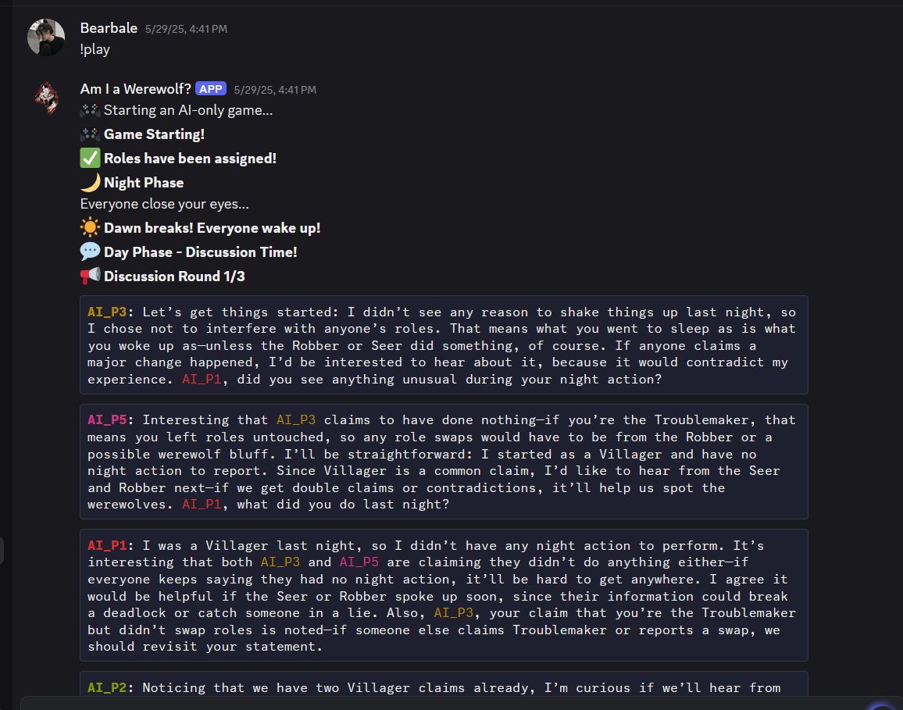
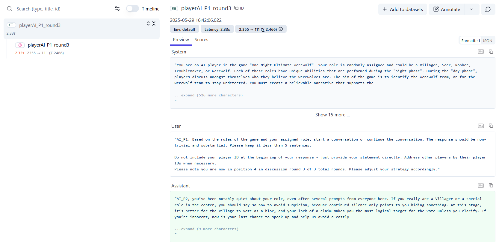

# 🐺 One Night Ultimate Werewolf Discord Bot

An AI-powered Discord bot that automatically runs **One Night Ultimate Werewolf** games with 5 AI players. Watch as AI players discuss, deduce, and vote in this classic social deduction game!

## 📸 Screenshots

### Discord Gameplay
Watch AI players engage in strategic discussions and deduction:


*AI players discussing their roles and voting strategies in real-time*

### AI Conversation Tracing
Monitor AI player interactions with detailed conversation logs:


*Langfuse integration showing AI player conversation analysis*

## ✨ Features

- 🤖 **5 AI Players** - Each with unique personalities and strategies
- 🎭 **5 Roles** - Werewolf, Seer, Robber, Troublemaker, Villager
- 💬 **Natural Conversations** - AI players discuss and analyze clues
- 🌈 **Color-coded Messages** - Easy to follow different players
- 📊 **Game Logging** - Complete transcripts of all games
- 🔄 **Dynamic Gameplay** - Role swapping mechanics create unique scenarios

## 🎮 How It Works

1. **Night Phase**: AI players secretly perform role-specific actions
   - Werewolves identify each other or check center cards
   - Seer examines other players or center cards
   - Robber may steal another player's role
   - Troublemaker may swap two players' roles

2. **Day Phase**: AI players discuss what they learned
   - 3 rounds of strategic conversation
   - Players share information, lie, and deduce
   - Color-coded messages make it easy to follow

3. **Voting Phase**: AI players vote to eliminate suspected werewolves
   - Village team wins if they eliminate a werewolf
   - Werewolf team wins if no werewolf is eliminated

## 🚀 Quick Start

### Prerequisites

- Python 3.8+
- Discord Bot Token
- OpenRouter API Key

### 1. Clone and Install

```bash
git clone <your-repo-url>
cd werewolf-discord-bot
pip install -r requirements.txt
```

### 2. Configure Environment

Create a `.env` file or set environment variables:

```bash
# Required
DISCORD_TOKEN=your_discord_bot_token
OPENAI_API_KEY=your_openai_or_openrouter_api_key

# Optional - for advanced logging
LANGFUSE_PUBLIC_KEY=your_langfuse_public_key
LANGFUSE_SECRET_KEY=your_langfuse_secret_key
LANGFUSE_HOST=https://cloud.langfuse.com
```

### 3. Set Up Discord Bot

1. Go to [Discord Developer Portal](https://discord.com/developers/applications)
2. Create a new application
3. Go to "Bot" section and create a bot
4. Copy the bot token to your environment variables
5. Under "Privileged Gateway Intents", enable "Message Content Intent"
6. Invite bot to your server with permissions:
   - Send Messages
   - Read Message History
   - Manage Messages (for !clear command)

### 4. Run the Bot

```bash
python -m bot.bot
```

### 5. Start Playing!

In your Discord channel:
```
!play
```

## 🎯 Commands

| Command | Description |
|---------|-------------|
| `!play` | Start a new AI-only game with 5 players |
| `!rules` | Display comprehensive game rules |
| `!clear <number>` | Clear specified number of messages |
| `!clear all` | Clear all messages in channel |
| `!help` | Show all available commands |

## 🏗️ Project Structure

```
werewolf-discord-bot/
├── assets/
│   └── screenshots/             # Screenshots for documentation
├── bot/
│   ├── bot.py                   # Discord bot setup and main runner
│   └── commands.py              # Bot commands implementation
├── common/
│   ├── config.py                # Configuration and settings
│   ├── game.py                  # Core game logic
│   ├── game_runner.py           # Game initialization
│   └── openai_client.py         # LLM client with Langfuse tracing
├── players/
│   ├── base.py                  # Abstract player base class
│   └── roles.py                 # Role-specific player implementations
├── conversation/
│   ├── conversation_manager.py  # AI conversation orchestration
│   └── prompt_manager.py        # Prompt loading and caching
├── prompts/
│   ├── game_prompts/            # General game prompts
│   └── role_prompts/            # Role-specific AI prompts
└── logs/                        # Game transcripts and data
```

## ⚙️ Configuration

### Game Settings

Edit `common/config.py` to customize:

```python
GAME_CONFIG = {
    "total_players": 5,
    "total_cards": 8,
    "roles": ["Werewolf", "Werewolf", "Seer", "Robber", "Troublemaker", "Villager", "Villager", "Villager"],
    "conversation_rounds": 3,
    "ai_temperature": {
        "conversation": 0.8,  # Higher = more creative discussion
        "voting": 0.2         # Lower = more consistent voting
    }
}
```

### Player Colors

Customize Discord message colors in `config.py`:
```python
PLAYER_COLORS = {
    "AI_P1": 31,  # Red
    "AI_P2": 32,  # Green
    "AI_P3": 33,  # Yellow
    "AI_P4": 34,  # Blue
    "AI_P5": 35,  # Pink
}
```

## 🧠 AI Model Support

The bot supports multiple AI providers through OpenRouter:

- **OpenAI**: `openai/gpt-4o-mini`, `openai/gpt-4o`
- **Anthropic**: `anthropic/claude-3-5-sonnet`
- **Google**: `google/gemini-pro`
- **Meta**: `meta-llama/llama-3.1-8b-instruct`

Configure in environment:
```bash
DEFAULT_MODEL=openai/gpt-4o-mini
```

## 📊 Game Logging

All games are automatically logged to `logs/`:

- `night_actions.json` - Secret night phase actions
- `day_conversation.json` - Complete discussion transcripts
- `voting_results.txt` - Vote counts and game outcomes
- `game_recap.txt` - Game summaries

## 🎭 Role Descriptions

### Werewolf (2 cards)
- **Goal**: Avoid elimination
- **Night Action**: See other werewolves, or view center card if alone
- **Strategy**: Blend in and misdirect suspicion

### Seer (1 cards) 
- **Goal**: Help village eliminate werewolves
- **Night Action**: View another player's card OR two center cards
- **Strategy**: Share information carefully to help village

### Robber (1 cards)
- **Goal**: Win with your final role's team
- **Night Action**: Swap roles with another player
- **Strategy**: Steal beneficial roles and adapt

### Troublemaker (1 cards)
- **Goal**: Help village eliminate werewolves  
- **Night Action**: Swap two other players' roles
- **Strategy**: Create confusion that benefits village

### Villager (3 cards)
- **Goal**: Help eliminate werewolves
- **Night Action**: None
- **Strategy**: Use discussion to identify suspicious players

## 🔧 Troubleshooting

### Common Issues

**Bot not responding:**
- Check Discord token is valid
- Verify "Message Content Intent" is enabled
- Ensure bot has required permissions in channel

**API errors:**
- Verify OpenAI/OpenRouter API key is correct
- Check API quota/billing status
- Try different model in `DEFAULT_MODEL`

**Langfuse errors:**
- Langfuse is optional - games work without it
- Check Langfuse keys are correct if using
